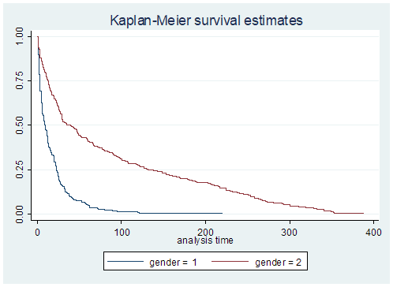
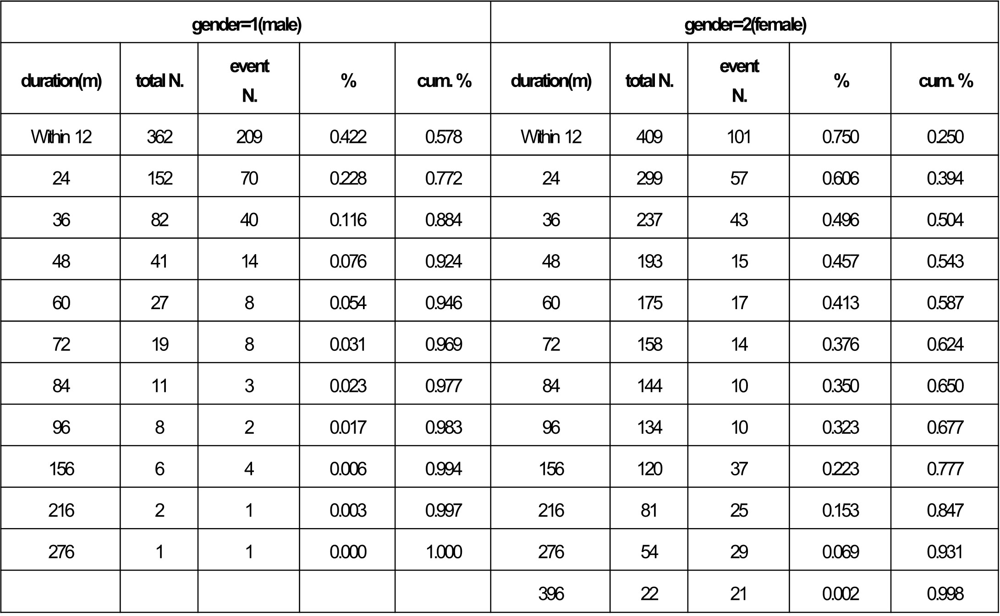

# an analysis of the progressive retirement of middle-aged adults

This study focused on the period of reemployment and job security after retirement of the primary job in order to in-depth life the dynamics of the gradual retirement process for middle-aged people. 

[Research Questions]  
* First, what factors affect **the duration of reemployment** of middle-aged adults?  
* Second, what factors affect **the wage stability of reemployment jobs** of middle-aged adults?  
* Third, what factors affect **employment stability of reemployment jobs** of middle-aged adults?  

## Analysis1. Event History Analysis

According to Hardy & Bryman(2004), Event history analysis is a term commonly used to describe a variety of statistical methods that are designed to describe, explain or predict the occurrence of events. Outside the social sciences, these methods are often called survival analysis, owing to the fact that they were originally developed by biostatisticians to analyze the occurrence of deaths.

### packages used are as follow:  

* stsum
* [sts graph](https://www.stata.com/manuals/ststsgraph.pdf)

* [stcurve](https://www.stata.com/manuals/ststcurve.pdf)
* [stcox](https://www.stata.com/manuals/ststcox.pdf)
* [ltable](https://www.stata.com/manuals/stltable.pdf)

## Analysis2. logistic analysis

to analyze factors affecting the wage stability of reemployment jobs of middle-aged adults, logistic analysis was used(reemployed work which is upper/lower 80% of the main job wage income).

### packages used are as follow:  
* logit

## Analysis3. multinominal logistic analysis
to analyze factors affecting employment stability of reemployment jobs of middle-aged adults, multi logistic analysis was used(self-employment/temporary work/permanent work).

### packages used are as follow:  
* mlogit

## [Reference]  
[ALLISON, P. (2004). Event history analysis. In Handbook of data analysis (pp. 369-385). SAGE Publications, Ltd, https://www.doi.org/10.4135/9781848608184](https://methods.sagepub.com/book/handbook-of-data-analysis/n16.xml)  
[Jeong, S. J., Choi, S. J. (2021). An Analysis of the Progressive Retirement Process of Middle-aged Men: Focusing on the Period of Retirement and Job Stability. The Journal of Vocational Education Research 2021;40(2):71-94.](https://sites.google.com/view/seongjijeong/research-avenues/career-development-of-the-middle-aged?authuser=0#h.hv7jwouxfa6l)